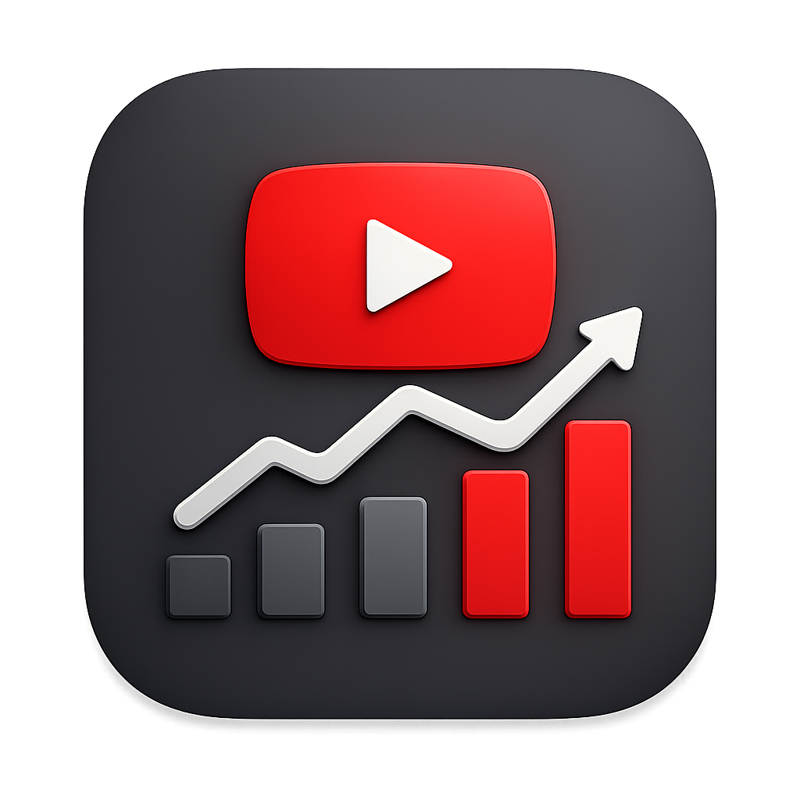

<div align="center">



# YouTube Channel Tracker

**A Mac desktop app for managing your entire YouTube production pipeline —**  
**from first idea to published video.**

[](https://github.com/jasonr1902/Youtube-Channel-Tracker/releases/latest)
[](https://github.com/jasonr1902/Youtube-Channel-Tracker/releases/latest)
[](https://github.com/jasonr1902/Youtube-Channel-Tracker/releases)

<br/>

[**⬇ Download for Mac**](https://github.com/jasonr1902/Youtube-Channel-Tracker/releases/latest)

> Requires macOS · Apple Silicon (M1 or later)

</div>

---

## What it does

YouTube Channel Tracker replaces spreadsheets and sticky notes with a purpose-built app for creators. Track every video from raw idea to live upload, sync real analytics from YouTube, and never lose an idea again.

| Feature | Description |
|---|---|
| 💡 **Idea Vault** | Capture ideas with stage, priority, series, and notes. Archive old ones without losing them. |
| 📋 **Pipeline Board** | Kanban-style view — drag cards across Idea → Script → Filming → Editing → Scheduled → Published. |
| 📈 **Analytics** | Pull real view counts, watch time, CTR, and subscriber data directly from the YouTube API. |
| 📤 **Publish Queue** | Upload videos to YouTube from inside the app, with scheduling and thumbnail management. |
| 🎯 **Goals** | Set subscriber, view, and revenue targets and track progress over time. |
| 📅 **Calendar** | See your scheduled and published videos laid out by date. |
| ⏱️ **Stage Timeline** | Every idea logs when it enters each stage — so you can see exactly where time is spent. |
| 🔄 **Auto-Update** | The app updates itself silently in the background when new versions are released. |

---

## Installation

### Step 1 — Download

[**Download the latest DMG from GitHub Releases**](https://github.com/jasonr1902/Youtube-Channel-Tracker/releases/latest)

### Step 2 — Install

1. Open the `.dmg` file
2. Drag **YouTube Channel Tracker** into your **Applications** folder
3. Eject the disk image

### Step 3 — First launch (macOS security)

Because the app isn't notarized by Apple, macOS may say it's "damaged" or block it on first open. This is a Gatekeeper warning — the app is safe. Remove the quarantine flag with one Terminal command:

```bash
xattr -cr "/Applications/YouTube Channel Tracker.app"
```

Then double-click the app normally. You only need to do this once.

---

## Connecting YouTube (optional but recommended)

The app works offline for tracking ideas and managing your pipeline. To pull in real analytics and upload videos directly, connect it to your YouTube account via the Google API.

### 1 · Create a Google Cloud project

Go to [console.cloud.google.com](https://console.cloud.google.com) and create a new project (any name).

### 2 · Enable the YouTube APIs

Inside your project, go to **APIs & Services → Library** and enable both:
- **YouTube Data API v3**
- **YouTube Analytics API**

### 3 · Create OAuth credentials

1. Go to **APIs & Services → Credentials → Create Credentials → OAuth client ID**
2. If prompted, configure the OAuth consent screen first:
   - User type: **External**
   - Fill in app name and your email — the other fields are optional
3. For **Application type**, choose **Desktop app**
4. Click **Create** — copy the **Client ID** and **Client Secret**

### 4 · Add yourself as a test user

Still in the OAuth consent screen, scroll to **Test users** and click **+ ADD USERS**.  
Add the Google account email you'll sign in with. This is required even for your own account while the app is in testing mode.

### 5 · Connect inside the app

1. Open **Settings** in the sidebar
2. Paste your **Client ID** and **Client Secret**
3. Click **Connect YouTube Account** — your browser will open for sign-in
4. After approving, you're connected. Analytics and upload features are now active.

---

## Running from source

If you want to build or develop the app yourself:

```bash
# Prerequisites: Node.js 20+, npm

git clone https://github.com/jasonr1902/Youtube-Channel-Tracker.git
cd Youtube-Channel-Tracker
npm install
npm run dev
```

### Build a DMG

```bash
npm run package
# Output: dist/YouTube-Channel-Tracker-0.1.0-arm64.dmg
```

### Release a new version

```bash
# 1. Bump version in package.json
# 2. Commit and push
# 3. Run:
GH_TOKEN=your_github_token npm run release
```

This builds the app, creates a GitHub Release, and uploads the DMG. Users with the app installed will be notified and can update with one click.

---

## Tech stack

Built with [Electron](https://electronjs.org) · [React](https://react.dev) · [TypeScript](https://typescriptlang.org) · [SQLite (better-sqlite3)](https://github.com/WiseLibs/better-sqlite3) · [Tailwind CSS](https://tailwindcss.com) · [electron-builder](https://electron.build) · [electron-updater](https://www.electron.build/auto-update)

---

## Support

If this app saves you time, a coffee goes a long way 🙏

<a href="https://ko-fi.com/jasonr1902">
  
</a>

---

<div align="center">
<sub>Made for creators who want to stay organized without leaving their Mac.</sub>
</div>
